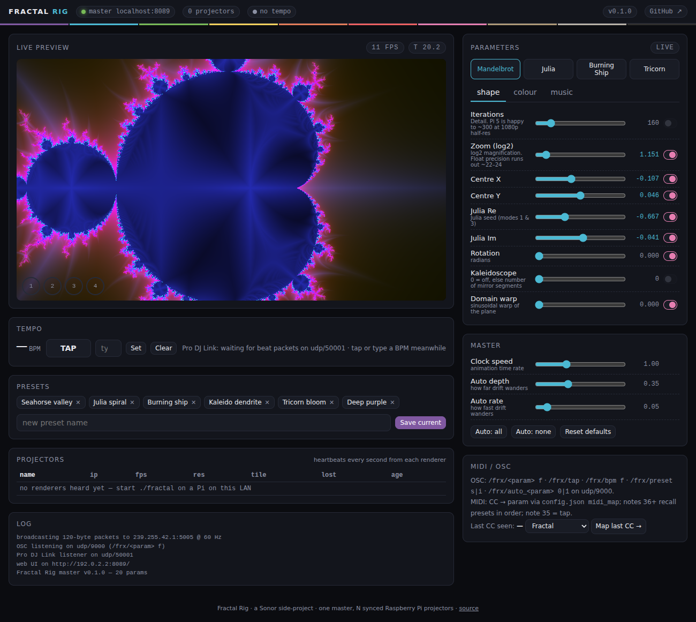

# Fractal Rig

One Raspberry Pi is the **master**. Four (or forty) Raspberry Pis are **renderers**,
each driving a projector over HDMI. The master broadcasts every parameter of the
fractal 60 times a second over the LAN; every renderer draws the *same*
GPU shader from the *same* numbers, so the wall moves as one — same image on every
projector, one giant tiled canvas, or a family of variations. The master takes
its cues from the web UI on your phone, a MIDI controller, OSC (TouchOSC etc.),
the Pioneer **Pro DJ Link** beat grid from an XDJ / CDJ, a microphone, or just
drifts on its own.

**Live demo of the control surface (no Pis needed):** https://sonorltd.github.io/sonor-fractal-rig/
— runs the identical shader in your browser, in "demo mode".



```
              phone / laptop ── http :8080 ──┐
              MIDI controller ── USB ────────┤
              TouchOSC ───────── OSC :9000 ──┤        UDP multicast 239.255.42.1:5005 @ 60 Hz
    XDJ-RX2 / CDJ ── Pro DJ Link :50001 ─────┤            120 bytes: clock + beat + 20 params
              mic / line-in ─── (optional) ──┤                          │
                                             ▼                          ▼
                                    ┌─────────────────┐     ┌──────────┬──────────┬──────────┬──────────┐
                                    │  fractal-master │ ──▶ │ fractal-2│ fractal-3│ fractal-4│ fractal-5│
                                    │  master.py      │     │ ./fractal│ ./fractal│ ./fractal│ ./fractal│
                                    │  + ./fractal    │     └────┬─────┴────┬─────┴────┬─────┴────┬─────┘
                                    └────────┬────────┘          │          │          │          │
                                          HDMI ▼              HDMI ▼     HDMI ▼     HDMI ▼     HDMI ▼
                                        projector 1              2          3          4          5
```

## What's in the box

| path | what | runs on |
|---|---|---|
| `renderer/` | `fractal.c` — C/SDL2/GLES3 fullscreen renderer. Multicast in, HDMI out, tiling, freewheel, heartbeat. `pm_bridge.c` + `shaders/post.frag` — optional libprojectM 4 scene with PCM stream + post-pass. | every Pi |
| `renderer/shaders/fractal.frag` | **The** shader: 8 scenes — Mandelbrot / Julia / Burning Ship / Tricorn fractals plus Plasma / Tunnel / Starfield / Waves (the Winamp-AVS end of things) — orbit-trap glow, kaleidoscope, domain warp, beat pulse, bar sway. Byte-identical on Pis and in the web preview. | GPU |
| `master/` | `master.py` + `engine.py` + `inputs.py` + `outputs.py` — asyncio param engine, Ableton Link, OSC→Resolume, LED (DDP/Art-Net/sACN), thumbnail receiver, 60 Hz broadcaster, web UI + WebSocket, Pro DJ Link / MIDI / OSC / audio inputs, presets, fleet heartbeat. | master Pi (or a laptop) |
| `master/params.py` | Single source of truth for the parameter table → generates `params.h`, `params.glsl`, `params.js`. | — |
| `web/` | `index.html` (markup) + `css/{theme,nav,app}.css` + `js/*.js` (one file per tab; `js/nav.js` = the menus) — phone-friendly control surface: Sources panel (live link status + on/off for Pro DJ Link, audio, MIDI, OSC, auto-drift), all params, presets, fleet, and an **Info** tab with the full manual. Live WebGL2 preview. Live when served by the master, demo mode on GitHub Pages. | browser |
| `setup/` | `install.sh` (role = master or slave), `selftest.sh` (pass/fail bring-up checker), `install-projectm.sh`, `install-ndi.sh`, `install-kiosk.sh` (touchscreen console), systemd units, host naming examples. | Pi |
| `PROTOCOL.md` | The wire format and the sync reasoning. | — |

## Hardware

* **Raspberry Pi 5** (recommended) or **Pi 4**, one per projector. The Pi 5's VideoCore VII
  does 1080p at ~60 fps with the default `--scale 0.6` (renders 1152×648 and upscales — on a
  projector you can't tell) and 150–300 iterations. Pi 4: use `--scale 0.5` and ~120 iterations.
  Pi Zero 2 / Pi 3 work at `--scale 0.35` for slower, simpler scenes.
* Each Pi has **two** micro-HDMI ports — a Pi can feed two projectors with the same picture
  via a splitter, or (future) two independent tiles.
* **Wired gigabit switch.** Multicast over Wi-Fi works but jitters; a £15 8-port switch and
  five patch leads is the single biggest reliability win.
* Official 27 W (Pi 5) / 15 W (Pi 4) PSUs. Under-powered Pis throttle the GPU — and brown-outs corrupt SD cards. A laptop USB-C charger only offers 5 V at 3 A: fine for a Pi 4, **not** for a Pi 5.
* Master and every renderer on the **same wired switch**. Multicast between Wi-Fi clients through an access point is throttled or dropped by most APs.
* 2 GB Pi 5 is enough for renderer or master; 4 GB if that Pi also runs the touchscreen kiosk. 32 GB card minimum, 64 GB comfortable (A2-rated).
* Master extras: the Pi's own USB for a MIDI controller; a USB audio interface or the XDJ's
  USB audio for live energy (optional); an Ethernet path to the **XDJ-RX2 LINK port**.

## Install (each Pi, Raspberry Pi OS Bookworm Lite or Desktop)

```bash
sudo apt install -y git
git clone https://github.com/sonorltd/sonor-fractal-rig.git ~/fractal-rig
cd ~/fractal-rig

# projector Pis
sudo bash setup/install.sh slave
# the brain (also renders → projector #1)
sudo bash setup/install.sh master
```

That builds the renderer, creates a venv for the master, installs systemd units that start
at boot (`fractal-renderer`, `fractal-master`), and adds the user to the video/render groups.
On Pi OS **Lite** the renderer draws straight to the HDMI output through KMSDRM — no desktop
needed. On Pi OS **Desktop** remove the `SDL_VIDEODRIVER=KMSDRM` line from the unit and it
runs as a fullscreen Wayland/X window instead.

Then on every Pi run the self-test — it listens for the master's multicast, Pro DJ Link traffic,
checks groups/GPU/SDL, services, fps, MIDI and audio devices, temperature and throttling:

```bash
bash setup/selftest.sh
```

Open the web UI from any phone on the LAN: **`http://<master-ip>:8080/`** (the master logs
the URL: `journalctl -fu fractal-master`).

### Layouts

Renderer arguments go on the install line (or `sudo systemctl edit fractal-renderer`):

```bash
sudo bash setup/install.sh slave                          # same image on every projector (default)
sudo bash setup/install.sh slave --tile 2 2 1 0           # this Pi = top-right of a 2×2 canvas
sudo bash setup/install.sh slave --view 0.7 1.57 0.15     # same fractal, +0.7 log2 zoom, 90°, +0.15 hue
sudo bash setup/install.sh slave --scale 0.5 --name stage-left
```

See `setup/hosts.example.txt` for a full 5-Pi naming plan. Mix freely — a 2×2 tiled wall plus
a fifth projector showing a rotated variation is one line per Pi.

## Scenes

| # | scene | notes |
|---|---|---|
| 0–3 | Mandelbrot · Julia · Burning Ship · Tricorn | escape-time fractals with orbit-trap glow |
| 4 | Plasma | classic demoscene plasma; `warp` = turbulence |
| 5 | Tunnel | Winamp/AVS-style infinite tunnel; `beat_pulse` lunges on the kick |
| 6 | Starfield | hyperspace warp; `warp` = streak length |
| 7 | Waves | oscilloscope wave stack; `energy`/`bass` shape it live |
| 8 | **projectM** | real Milkdrop `.milk` presets via libprojectM 4 on each Pi — master picks the preset, streams PCM audio (or Pis synthesise a beat-locked signal), optional kaleido/zoom/hue post-pass via `pm_mix`. Optional install: `sudo bash setup/install-projectm.sh` |

Scenes 0–7 share one shader, so kaleidoscope, rotation, palette and beat controls work on every one and every MIDI/OSC mapping stays valid. Adding a scene is one function in `fractal.frag`.

### projectM (scene 8)

`setup/install-projectm.sh` builds libprojectM 4 with GLES from source on each Pi (~15 min), pulls the original Milkdrop preset pack (`--cream` adds Cream of the Crop, ~10k presets) and the texture pack, and rebuilds the renderer with `HAVE_PROJECTM`. The master owns preset selection (`pm_preset` index into the byte-sorted preset list — identical on every Pi as long as the packs are identical; the Renderers table flags mismatches), prev/next/random/search/auto-cycle-every-N-bars in the UI, OSC `/frx/pm_next|pm_prev|pm_random`, MIDI notes 33/32. The master multicasts its audio input as PCM (udp/5007) so presets react to the room; without audio every Pi synthesises the same beat-locked kick from the shared clock. `pm_mix` runs projectM's output through our post-pass (kaleido, rotation, zoom, hue, beat pulse). The web UI's Live preview simulates scene 8 in the browser with [Butterchurn](https://github.com/jberg/butterchurn) (Milkdrop 2 in WebGL, vendored in `web/vendor/`), showing the same-named preset where the packs overlap. **Sync caveat:** Milkdrop presets use their own timing and randomness — Pis look alike (same preset, same audio, same switch frame) but are not pixel-identical, so use scenes 0–7 for seamless tiled walls and projectM for identical-image or family layouts.

## Video (v0.7)

Scene 9 plays **video clips frame-locked on every projector without streaming**: drop files on the
Media tab, the master converts them (ffmpeg → ≤1080p H.264), every Pi pulls the library over HTTP
(`fractal-media-sync`) and decodes its local copy with libmpv, tracking the master clock. Playlist,
auto-advance (clip end / every N bars), bar sync, Perform tiles, OSC `/frx/video …`, MIDI notes 31/30/29/28.
**LIVE** (clip 255) is the one real stream: an NDI source (Resolume over the LAN, no capture card), an HDMI capture dongle (UVC), any V4L2 camera, a looping
file or test bars → ffmpeg → multicast MPEG-TS → every Pi within ~0.5 s.

**Resolume tab** (two-way): rig → Resolume as NDI, Resolume → every projector as the LIVE feed, a per-projector
**feed mix** crossfade (`live_mix`, 5 blend modes), clip pad / layer faders / master over OSC, and Resolume's OSC
output mapped onto rig parameters with a learn button. **Shows** tab: whole-rig setups per venue (look, presets,
mapping for every projector, playlist, outputs, resolution) — save, load (whole or by part), update, export/import.

**Cues** (v0.8): a cue stack for the set — each cue changes scene / preset / show / video / feed mix / params, fades
over N bars, can auto-follow; GO/BACK on screen, MIDI, OSC. **Audio → parameters**: any parameter follows a band,
the bass, energy or the beat pulse. **Update from the page**: Rig tab pulls GitHub and reinstalls the master and every
Pi, restarts or reboots any of them.

**If the master drops out** every projector carries on by itself: same clock, last parameters, clips keep looping,
projectM keeps running; a LIVE feed (which only the master can send) falls back to the last shader scene after 3 s
and comes back automatically. Nothing goes black.

**Projection mapping** (Outputs tab, per projector, applied live): keystone corners, black-out mask
polygons with feather, soft-edge blend, brightness/gamma, test pattern. **Output resolution** selector
on the top bar (Auto / 1080p / 4K — a Pi 4 on a 4K TV wants 1080p). Every Pi has a status page on
port 8082 (renderer log, temperature/throttling, synced clips, mapping, link to the master).

## Outputs (v0.5)

| output | how |
|---|---|
| **Resolume** | Picture in via HDMI capture card (recommended) or NDI. Tempo + bar phase via **Ableton Link** (follow or lead). **OSC out**: tempo (normalised), resync on SET BEAT 1, scene → column, any param → any Resolume address. Resolume OSC out → `/frx/<param>` works too. |
| **NDI** | `setup/install-ndi.sh <SDK tar.gz>` on a Pi, then `--ndi`. Source "Fractal Rig (pi-name)" at render scale, 30 fps cap. |
| **LED pixel strips** | Master samples every renderer's 80×45 live thumbnail (udp/5008) along strip lines on the shared canvas and sends **DDP** (WLED), **Art-Net** or **sACN/E1.31** at 40 fps with gamma/brightness. Layout editor, matrix builder, test patterns and live canvas preview in the Outputs tab; persists in `config.local.json`. |
| **Perform mode** | `▶ PERFORM` / key `P` / `?perf=1`: big touch controls in swipeable pages (Show, Presets, Feel, Colour). `setup/install-kiosk.sh` turns a Pi + touchscreen into a boot-to-UI console. |

## Controlling it

| input | how |
|---|---|
| **Web UI** | three tabs. **Control**: Sources panel (link status + on/off per source), 8 scenes, sliders for all 20 params with per-param **auto-drift** toggles, presets, tap tempo (space bar), **SET BEAT 1** bar resync (key `1`), BPM entry, clock speed, drift depth/rate, fleet table, MIDI learn. **Status**: everything debuggable — link RTT, master CPU/temp/throttle, tick rate and worst gap, multicast/IGMP, per-source raw counters (incl. Pro DJ Link packet types), decks, per-Pi fps/loss/temp/version, effective config, full log, one-click diagnostics JSON. **Info**: the manual. Fully mobile-adaptive. |
| **Pro DJ Link** | Plug the master Pi into the same network as the XDJ-RX2 / CDJ **LINK** port. The master listens *passively* to the beat packets every player already broadcasts on UDP 50001 — no virtual-CDJ handshake, no player number to steal, nothing shows up on the decks. Locks BPM + beat-in-bar; `prodj_follow_device` in `config.json` pins a deck (0 = follow whichever deck beat most recently). |
| **MIDI** | Any class-compliant controller. `config.json → midi_map` maps CC → param (defaults for CC 1–12), notes 36+ recall presets in order, note 35 = tap, note 34 = set beat 1. "Map last CC →" in the UI does MIDI-learn for the session. |
| **OSC** | udp/9000: `/frx/<param> f` · `/frx/tap` · `/frx/beat1` · `/frx/bpm f` · `/frx/preset s|i` · `/frx/auto_<param> 0|1`. TouchOSC / Lemur / Ableton Max-for-Live all speak this. |
| **Audio** | `python3 master.py --audio` (or `"audio_enabled": true`). Drives the `energy` and `bass` params from RMS + a 30–150 Hz band with auto-gain; falls back to onset-detected beats when no Pro DJ Link is present. |
| **Autonomous** | Everything with the pink toggle drifts on smooth noise. Depth/rate live in the Master panel. Leave it and walk away. |
| **Inputs monitor** (v0.6) | Live scope under Tempo: 4-bar beat grid with playhead, **lock badge** (Pro DJ Link deck / Ableton Link peers / free-running) and BPM-spread readout, a lane per Pro DJ Link deck with its own beat boxes, Link phase, **audio waveform + 16-band spectrum + energy/bass meters** (streamed from the master at 15 Hz when Audio in is on), MIDI / OSC / Pro DJ Link activity chips. Slim beat grid in Perform mode. |

Master state (`state.json`) and presets (`presets.json`) persist across restarts.

### Pro DJ Link networking notes

* Pioneer gear on a LINK network without DHCP self-assigns `169.254.x.x`. Either put a small
  router/DHCP on the LINK switch (the Pis and decks then share one subnet) or give the master
  Pi a second address on `169.254.0.0/16` (`sudo nmcli con mod "Wired connection 1" +ipv4.addresses 169.254.42.10/16`).
* Beat packets are **broadcast**, so the master only has to be on the same L2 segment. Nothing
  is sent to the decks.
* Verified against the packet layout documented by Deep Symmetry's *dysentery* / *beat-link*
  projects (device number at 0x21, pitch at 0x54, BPM×100 at 0x5A, beat-in-bar at 0x5C).
  If your firmware ever moves a field, `inputs.py → ProDJLink` is 30 lines.
* Want full player status (which deck is *master*, track names, on-air)? Run
  [Beat Link Trigger](https://github.com/Deep-Symmetry/beat-link-trigger) on a laptop and have
  it send OSC (`/frx/bpm`, `/frx/tap`) to the master — the OSC input is already there.

## Development

```bash
# master on your laptop, renderer in a window on the same machine
cd master && pip install -r requirements.txt && python3 master.py --no-midi
cd renderer && make && ./fractal --window 960x540 --scale 1 --novsync

# edit the shader → both the Pis (on restart) and the web preview (on reload) pick it up
# add a parameter → master/params.py, then: python3 master/gen_params.py && make -C renderer
```

Only the renderer needs rebuilding when the parameter table changes; everything else
reads the generated tables at start-up.

## Roadmap

- [ ] second HDMI output per Pi as an independent tile (`--out 1`)
- [ ] edge-blend feathering for overlapping projectors (`--blend L R T B` in px)
- [ ] more scenes (Mandelbulb slices, Lyapunov, IFS ferns, spectrum bars via 8-band audio) behind the same `mode` param
- [ ] projectM: per-Pi seed + frame-time injection when libprojectM exposes it, for tighter cross-Pi match
- [ ] master failover — any renderer promotes itself if no packets for 10 s
- [ ] Beat Link Trigger recipe for track-name → preset switching

## Credits / why these choices

* **Custom GLSL, not projectM/Milkdrop** — every parameter is ours to sync, and the picture is a
  pure function of the packet, so N Pis are pixel-identical by construction.
* **Plain C + SDL2 on the Pi, Python on the master** — the renderer has to be boring and fast;
  the master has to be easy to hack at 1 a.m. at a gig.
* **Multicast + full-state packets** — no sessions, no reconnect logic, hot-plug any Pi.

Part of the Sonor workspace as a side-project (`STUDIO - Fractal Rig`). Not a Sonor product;
the UI is deliberately dark/stage-themed rather than Sonor slate.
